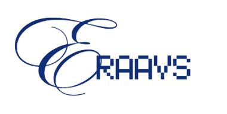

# ERAAVS - End-to-end Requirement Analysis and Verification System

ERAAVS is a sophisticated application designed for comprehensive requirement analysis and verification. The tool leverages advanced natural language processing techniques to process client requirements and product documentation, generating precise insights, intuitive visualizations, and detailed compliance reports.

## Key Features

- **Advanced Natural Language Processing (NLP)**: Analyzes requirements using sophisticated text processing techniques
- **Multi-file document upload**: Upload multiple client PDFs and product documentation PDFs for comprehensive analysis
- **Intelligent requirement matching**: Accurately matches client requirements with product documentation
- **Visual representation**: Clear, intuitive visualizations of requirement compliance status
- **Automated error detection**: Identifies unmet or partially met requirements
- **Comprehensive reporting**: Generates detailed PDF reports for documentation and sharing
- **AI enhancement**: Optional AI-powered analysis when API keys are available

## Quick Start

1. Open the application (deployed on Replit or installed locally)
2. Upload client requirement PDFs
3. Upload product documentation PDFs
4. Click "Analyze Requirements"
5. Review the analysis results
6. Download the detailed PDF report

## System Requirements

- The application works best with Python 3.10 or 3.11
- For Python 3.13+, see the installation guide for special instructions
- See [Installation Guide](installation_guide.md) for detailed installation instructions

## Usage Examples

### Typical Workflow

1. **Upload Documents**: Upload client requirements and product documentation PDFs
2. **Analyze**: Click the "Analyze Requirements" button
3. **Review Results**: See visual summaries and requirement categorization
4. **Check Details**: Expand individual requirements for detailed analysis
5. **Generate Report**: Create and download a PDF report of findings

### Use Cases

- **Product Compliance**: Verify if a product meets client requirements
- **Gap Analysis**: Identify missing or partially implemented features
- **Documentation Verification**: Ensure product documentation addresses all client requirements
- **Requirement Traceability**: Track which requirements are implemented in the product

## Deployment Options

- **Replit**: Run directly in Replit's environment (recommended for quick testing)
- **Local Installation**: Run on your local machine (see installation guide)
- **Cloud Deployment**: Deploy to Streamlit Cloud, Heroku, AWS, or other cloud platforms

## Technical Details

ERAAVS employs a modular architecture with the following components:

- **PDF Processing**: Extracts and cleans text from PDF documents
- **NLP Processing**: Identifies requirements and analyzes implementation status
- **Visualization**: Creates intuitive graphical representations of analysis
- **Report Generation**: Produces comprehensive PDF reports
- **AI Integration**: Optional advanced analysis with OpenAI or Anthropic APIs

## Documentation

- [Installation Guide](installation_guide.md): Detailed setup instructions
- [Technical Documentation](docs/technical_documentation.md): System architecture and algorithms (coming soon)
- [User Guide](docs/user_guide.md): Detailed usage instructions (coming soon)
- [API Reference](docs/api_reference.md): For programmatic integration (coming soon)
